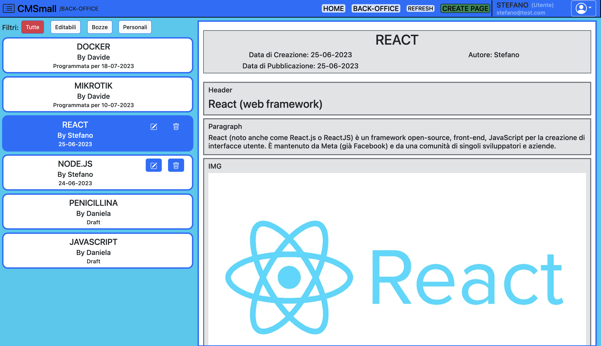

# Exam: "CMSmall" FINAL GRADE 30
## Student: HUGONIN ALBERTO

## React Client Application Routes

- Route `/`: main front-office root
- Route `/back-office`: page available only to logged-in users
- Route `/back-office/add`: page creation route

## API Server

- GET `/api/sessions/current`
  - Receives: authenticated request
  - Returns: an object containing the logged-in user's id, name, role, and email
- GET `/api/users`
  - Receives: authenticated request
  - Returns: a list of objects containing each user's name and id
  - Checks: the user must be an admin
- GET `/api/sitename`
  - Receives: request, authenticated or unauthenticated
  - Returns: the site name as a string
- GET `/api/images`
  - Receives: request, authenticated or unauthenticated
  - Returns: the list of publicly accessible images on the server
- GET `/api/pages/`
  - Receives: request, authenticated or unauthenticated
  - Returns: the list of already published pages without content if the user is not logged in, or all pages if the user is logged in
- GET `/api/pages/:id`
  - Receives: request, authenticated or unauthenticated, with an id parameter
  - Returns: the matching page with its content
  - Checks: if the page has not been published yet, it is returned only if the user is logged in
- POST `/api/session`
  - Receives: authentication request
  - Returns: if authentication succeeds, the session information (id, name, email, role); otherwise, an error
- POST `/api/pages`
  - Receives: authenticated request containing a page object
  - Returns: the id of the newly created page
  - Checks: the page may specify an owner, but before using it the server checks that it matches the requesting user, or that the requesting user is an administrator, for security reasons
- DELETE `/api/pages/:id`
  - Receives: authenticated request with a parameter
  - Returns: the id of the deleted page
  - Checks: deletion is performed only if requested by an administrator or by the author of the page
- DELETE `/api/sessions/current`
  - Receives: authenticated logout request
  - Returns: confirmation if logout succeeds
- PUT `/api/pages/:id`
  - Receives: authenticated request with an id parameter and a page object
  - Returns: the id of the modified page
  - Checks: the request body may specify an owner, but before using it the server checks that it matches the requesting user, or that the requesting user is an administrator, for security reasons
- PUT `/api/sitename`
  - Receives: authenticated request from an administrator with the site name string
  - Returns: the updated site name

## Database Tables

- Table `users` - contains the user id, email, name, salt, password, and role (0 administrator and 1 normal user)
- Table `pages` - contains the page id, title, author id (foreign key linked to the users table id), creation date, and publication date
- Table `contents` - contains the content id, pageId (page id foreign key), type for the content type, text, and image

## Main React Components

- `MainRoute` (in `MainRoute.jsx`): the main component responsible for displaying both the front-office and back-office, and for combining NavBar, PageCreator, and PagesBar
- `NavBar` (in `NavBar.jsx`): the top navigation bar. It manages access to login, page creation, and navigation buttons. It contains the `LoginMenu` component (in `LoginMenu.jsx`), a dropdown menu that provides the authentication interface
- `PageCreator` (in `PageCreator.jsx`): the main component responsible for displaying, editing, and creating pages. It receives page information from MainRoute and uses it for its own purposes by directly interacting with the APIs. It contains ContentsManager and ContentsCreator
- `ContentsManager` (in `ContentsManager.jsx`): the component responsible for managing content (editing, creation, and ordering), relying on ContentsCreator (in `ContentsCreator.jsx`) to manage each individual content item
- `PagesBar` (in `PagesBar.jsx`): the component responsible for displaying pages as a content list. By connecting MainRoute and PageCreator, it allows the selected page to be edited or deleted directly

## User Credentials

- stefano@test.com, pwd, User
- alberto@test.com, pwd, Admin
- anna@test.com, pwd, User
- daniela@test.com, pwd, User
- davide@test.com, pwd, User
